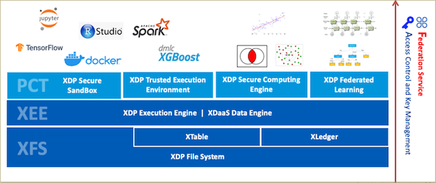
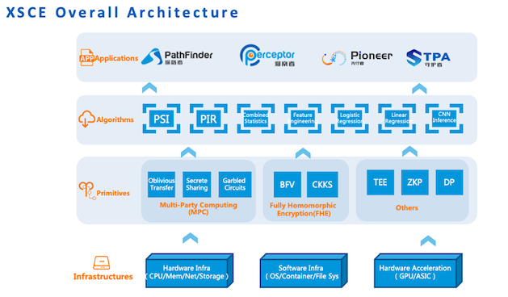

# XSCE

XDP stack is listed below including PCT technologies layer which provides sandbox, TEE, FL and MPC components to support a variety of algorithms and applications. XSCE is the MPC framework component integrated in XDP platform. 

  

XSCE (XDP Secure Computing Engine) is a unified MPC framework providing most frequently used algorithms and can be easily integrated by application software.

  

For current phase, XSCE provide PSI&PIR algorithms to open source, and more algorithms will come soon in the next few months.

#### build options
- **build**  

The XSCE has been tested on Linux. There is one dependency on libOTe. The lowest dependencies of build and run environment: Ubuntu 20, c++ 17, cmake 3.20, python3, instruction set: aes sse2 sse3 ssse3 sse4.1 sse4.2 avx avx2 avx256 avx512f pclmul bmi2 adx mmx.  
The XSCE can be built as:

```
./build.py libote xsce  
```
`./build.py libote` command will build libOTe library and xsce will use the library in `./third_party/libOTe_libs`, otherwise xsce will use the library in the default directory which is `/usr/local`.  
The libraries are libtoolkits.a, libcommon.a, libPSI.a and libPIR.a, will be located in the `./lib` directory, and the main executable with examples is pir/psi and is located in the build directory, eg build/bin/pir, build/bin/psi.

- **install**  

After build the XSCE, the libraries and headers for secondary developing can be installed as following:
```
./build.py install   install the headers and libs to the default path: /usr/local
or 
./build.py install=/xx/yy install the headers and libs to the configuration path: /xx/yy
```

- **docker**  

The XSCE provides docker file. Executing the following commands can build a compiled and installed xsce environment, the libraries and header files will be located in `/usr/local`. 
```
./build.py docker=images
```
After build the docker images, you can run the docker and git clone the source code, then build the examples in the docker by `./build.py xsce`.

By default, sudo is not used. If installation requires sudo access, then add `sudo`. See `./build.py help` for full details.

#### example
- **psi example**  

After building project, use the following command in the project root directory to run psi example:  
```
build/bin/psi
```

- **pir example**  

After building project, use the following command in the project root directory to run pir example:  
```
build/bin/pir
or
1. server party: build/bin/pir -r 0
2. client party: build/bin/pir -r 1
```

#### Algorithms design
- **PSI**  

PSI algorithm is implemented according to IACR paper “Private Set Intersection in the Internet Setting From Lightweight Oblivious PRF”: https://eprint.iacr.org/2020/729

- **PIR**  

PIR algorithm is implemented as below:
Input/output: client party uses single or multiple ids to query and get result from server, server party uses multiple string data for client to query each of which contains id field value. 
```
1. client uses ids to run psi algorithm with server, and get the server indexes of matched ids in server party.
2. server encrypts each string data with random keys which are oprf values  generated in PSI algorithm(for intersection elements, their oprf values are the same) and send them to client.
3. client uses local oprf values of matched elements to decrypt ciphertext data to plaintext string data. 
```

#### License

This project has been placed in the public domain and/or apache2.0 license.
